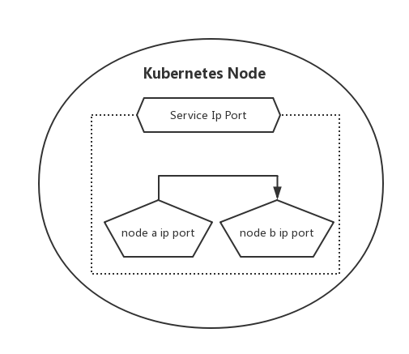
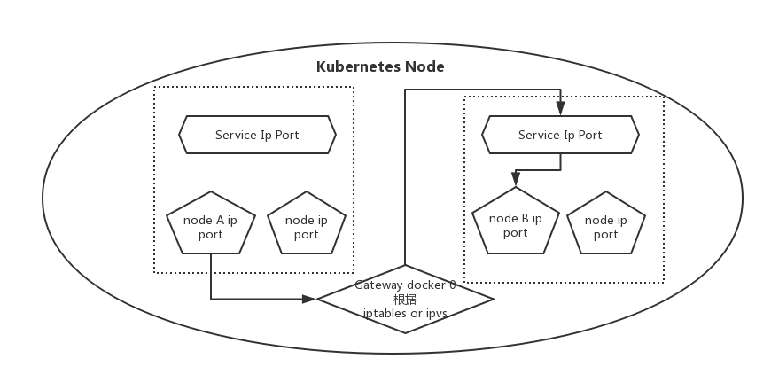

=====================
内部请求流量的交互
=====================

-------------------------
1、同一个pod中的容器交互
-------------------------

* 因为同一个pod内的容器存在NET共享，所以相互之间交互通过localhost

如下图所示:

-------------------------
2、pod之间的交互
-------------------------

* 各pod在同一网段可以直接进行通信。
* 通过 ``overlay network(叠加网络)`` ，隧道的方式，通过转发二层报文，让处于不同节点的pod能够通信。

------------------------
3、pod和service的交互
------------------------

* service的地址是iptables或者ipvs的规则。
* pod只需要将请求报文发往当前宿主机的网关，则网管就可以根据iptables规则进行转发。

如下图所示:

