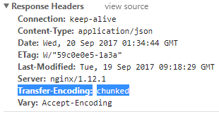
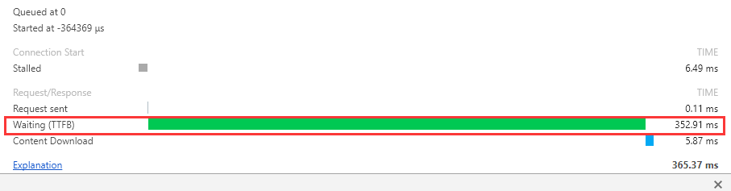
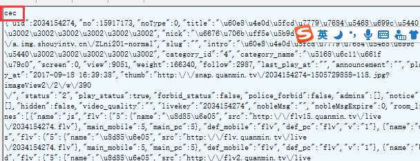
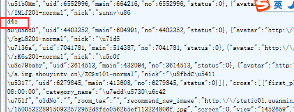
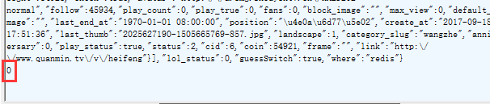

=============================
Transfer-Encoding:chunked
=============================

---------------------
1、功能
---------------------

**在http/1.1中提供** ``分块编码`` **的功能**

----------------
2、简单介绍
----------------

* 存在响应头里面

* 浏览器通过读取 ``content-length`` 长度来读取服务端实体信息，如果content-length大于实体信息，则会pending；如果content-length比实体信息小，则会截断实体信息，读取部分实体信息。

* 由于 Content-Length 字段必须真实反映实体长度，但实际应用中，有些时候实体长度并没那么好获得，例如实体来自于网络文件，或者由动态语言生成。这时候要想准确获取长度，只能开一个足够大的 buffer，等内容全部生成好再计算。但这样做一方面需要更大的内存开销，另一方面也会让客户端等更久。

* web优化有个指标叫做 ``TTFB`` ，他表示 ``从客户端发出请求并收到响应的第一个字节所花费的时间`` ,TTFB越短，表示web页面展现越快，用户体验也越好。但如果content-length在某些不容易计算的内容进行提前计算，势必会花费比较大的时间，从而造成TTFB增长。为了解决这个问题，**引入了一个新的机制：不依赖头部的长度信息，也能知道实体的边界**。

----------------------
2、chunked消息格式
----------------------

* 如果一个HTTP消息（请求消息或应答消息）的Transfer-Encoding消息头的值为chunked，那么，消息体由数量未定的块组成，并以最后一个大小为0的块为结束。

* 每一个非空的块都以该块包含数据的字节数（字节数以十六进制表示）开始，跟随一个CRLF （回车及换行），然后是数据本身，最后块CRLF结束。在一些实现中，块大小和CRLF之间填充有白空格（0x20）。

* 最后一块是单行，由块大小（0），一些可选的填充白空格，以及CRLF。最后一块不再包含任何数据，但是可以发送可选的尾部，包括消息头字段。

* 消息最后以CRLF结尾。

例子：

*cec表示接下来的长度，16进制cec表示3308长度，那么下面的部分实体是3308，接着到第二个部分实体：*

* d4e长度以及内容，依次循环，直到到达实体内容最后部分：*

*以0结束*

-------------------------
3、传输原则
-------------------------

**当gzip压缩和chunked共存的时候，是将内容先进行gzip后，然后对gzip后的内容进行分块chunked传输，而不是先分块传输然后进行单独压缩。**

reference:

https://zh.wikipedia.org/wiki/分块传输编码
https://imququ.com/post/transfer-encoding-header-in-http.html

:doc:`My document about gzip <../../../linux/services/nginx/nginx_gzip>`

